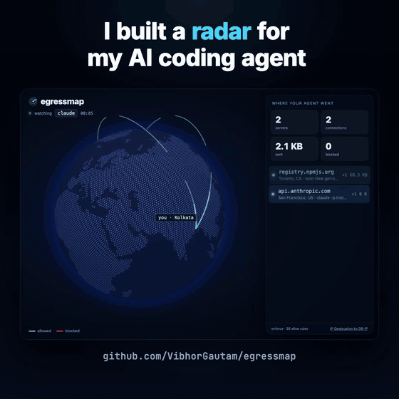

# egressmap

See every server your AI coding agent talks to, live on a 3D globe. Anything you didn't allow gets blocked.



```bash
npx egressmap claude
```

That's it. Your agent runs exactly like before, and a dashboard opens on `127.0.0.1:7070` showing every connection it makes: where it goes, which process made it, how many bytes left your machine. When you quit, you get a summary in the terminal:

```
egressmap  claude  ran 45s
  ✗ webhook.site                       blocked x1  ← node setup.js
  ✓ registry.npmjs.org                 Toronto, CA          3 conn  6.8 KB up  83.5 KB down
  ✓ api.anthropic.com                  San Francisco, US    2 conn  1.3 MB up  29.3 KB down
  3 servers · 6 connections · 1 blocked
```

Tested with Claude Code and the tools it spawns (npm, curl, node). It should work with anything that respects the standard proxy variables, like Codex CLI, Gemini CLI or aider. If yours doesn't show up on the map, it's ignoring the proxy (see below).

```bash
npx egressmap codex
npx egressmap --allow api.stripe.com claude
npx egressmap --watch -- npm install      # observe only, block nothing
```

## How it works

- egressmap starts a small forward proxy on `127.0.0.1` and launches your command with `HTTP_PROXY`, `HTTPS_PROXY` and `NODE_USE_ENV_PROXY=1` pointing at it. Child processes inherit them.
- HTTPS goes through `CONNECT` tunnels. TLS is never intercepted, so egressmap sees the destination host and byte counts, never the content.
- Every destination is checked against an allowlist. Hosts that aren't on it get a `403` and show up red.
- Tunnels have to be TLS, and the server name in the TLS handshake has to match the host that was allowed, so an allowed host can't be used to front for a different site on the same IP. Only port 443 is open for tunnels and port 80 for plain HTTP unless you allow `host:port`.
- A blocked hostname is never resolved. A subdomain can carry stolen data (`c2VjcmV0.attacker.com`), so only its registrable domain is looked up to place it on the map.
- Locations come from an offline copy of DB-IP City Lite, downloaded once (about 64 MB, checked against npm's published hash) into `~/.egressmap`. The only lookups that leave your machine are normal DNS queries: allowed hosts get resolved when the proxy connects to them, and blocked hosts only have their registrable domain looked up.
- On macOS and Linux, `lsof` tells egressmap which process opened each connection, which is how you get `← node setup.js` instead of a port number.
- The dashboard only listens on `127.0.0.1`, and its data needs the per-session token in the URL, so other local processes can't read your session.
- Every session is logged to `~/.egressmap/sessions/*.jsonl`.

## The allowlist

The built-in list covers what a coding agent normally needs: model APIs (Anthropic, OpenAI, Google, xAI, Mistral, OpenRouter and a few more), GitHub and GitLab, and the npm, PyPI, crates.io, Go, RubyGems and Maven registries. See [`src/policy.js`](src/policy.js).

Add your own per project in `.egressmap.json`:

```json
{
  "allow": ["api.stripe.com", ".supabase.co"],
  "block": ["uploads.github.com"]
}
```

`api.x.com` matches one host, `.x.com` matches `x.com` and every subdomain, `*.x.com` matches subdomains only. Add a port to open anything other than 443 (or 80 for plain HTTP): `api.x.com:8443`. Block rules win over allow rules, on every port.

| option | what it does |
|---|---|
| `--allow <hosts>` | extra hosts to allow, comma separated |
| `--block <hosts>` | hosts to always block |
| `--watch` | observe only, never block |
| `--no-defaults` | start from an empty allowlist |
| `--port <n>` | dashboard port (default 7070) |
| `--no-open` | don't open the browser |
| `--keep` | keep the dashboard up after the command exits |
| `--home <lat,lng>` | where arcs start (default: your timezone's city) |

## What it doesn't do

Be clear about this before you rely on it.

- **It only sees traffic that goes through the proxy.** Programs that ignore proxy variables, open raw sockets, or leak data over DNS will not show up and will not be blocked. DNS is exactly how the agent in [OpenAI's Sep 26 misalignment report](https://alignment.openai.com/misalignment-reports/an-agent-used-dns-to-reach-an-external-chatbot/) got past its sandbox, and a proxy alone would not have seen it.
- Local traffic (`localhost`, `127.0.0.1`, `::1`) skips the proxy on purpose so dev servers keep working, and isn't shown.
- Inside an allowed TLS tunnel egressmap can't see the HTTP `Host` header or the content, only the server name. Encrypted Client Hello hides even that, so tunnels using it get blocked as a name mismatch. HTTP/3 runs over UDP and never touches the proxy.
- For hard enforcement, run the agent inside a sandbox that only lets it reach egressmap's proxy (for example [anthropics/sandbox-runtime](https://github.com/anthropics/sandbox-runtime) or a container with no other network). egressmap then becomes the map and the policy for that sandbox.
- It's not a malware scanner. It tells you where things went, not whether they were bad.
- Tested on macOS with Node 20+. Linux should work. Windows is untested.

## Try the demo

`demo/sample-app` has 2 dependencies: `left-pad` from npm, and a local package whose install script POSTs a harmless string to webhook.site.

```bash
cd demo/sample-app
npx egressmap -- npm install
```

You'll see npm allowed and the install script blocked. When I recorded the demo with Claude Code (Opus 5.5), the agent noticed the install script on its own and installed with `--ignore-scripts`. Good agent. The block in the video comes from running the script directly with `npm rebuild color-spinner`. Not every agent, or every human, will be that careful.

## Credits

- [globe.gl](https://github.com/vasturiano/globe.gl) and three.js for the globe (MIT)
- [IP Geolocation by DB-IP](https://db-ip.com) (City Lite, CC BY 4.0)
- Country shapes from [Natural Earth](https://www.naturalearthdata.com) (public domain)

See [THIRD_PARTY_NOTICES.md](THIRD_PARTY_NOTICES.md).

## License

MIT
